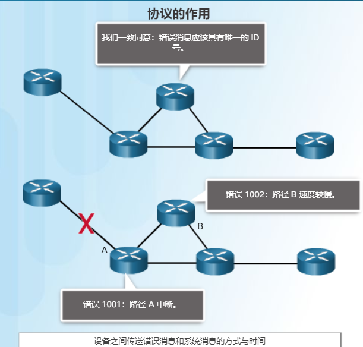

# 探索网络


| 单词            | 释意   | 术语                | 释意     |
| --------------- | ------ | ------------------- | -------- |
| scenario        | 方案   | scalable            | 可拓展的 |
| dish or antenna | 天线   | modular             | 模块化的 |
| geographic      | 地理的 | MAN(Metro Ethernet) | 城域网   |
|                 |        | intermediary        | 中间设备 |
|                 |        | congestion          | 拥堵     |
|                 |        | transfer            | 网络介质 |

##错题:

A converged network unifies different network services, such as streaming video, voice, and data, on a single platform and within a single infrastructure.

内联网

Intranets connect LANs and WANs that should only be accessible by internal employees, whereas an extranet allows organizations to do business directly with other external organizations by allowing them access to part of the internal network.


思科将其称为以人为本的网络。以人为本的网络重点关注 Internet 和网络对人们和企业的影响

- **对等 (P2P) 文件共享** – 对等文件共享使人们可以彼此共享文件，而不必存储并从中央服务器下载。用户安装 P2P 软件即可加入 P2P 网络。P2P 文件共享尚未得到所有人的认可。很多人担心这会违反版权保护资料的相关法律。


### 1.2.1 网络组件

当一台终端设备发起通信时，会使用目的终端设备的地址来指定应该将消息发送到哪里。

- **电缆内的金属线** - 数据将编码为电脉冲
- **玻璃或塑料光纤（光缆）** - 数据将编码为光脉冲
- **无线传输** - 使用电磁波谱中的波长编码数据


- **网络接口卡** - 即 PC 或其他终端设备上的网卡或 LAN 适配卡，用于提供与网络之间的物理连接。连接 PC 与网络设备的介质，将直接插入网卡（图 2）
- **物理端口** - 网络设备上的接口或插口，介质通过它连接到终端设备或其他网络设备。
- **接口** - 网络设备上连接到独立网络的专用端口。由于路由器用于互连不同的网络，路由器上的端口称为网络接口。


- **物理拓扑图** - 识别中间设备和电缆安装的物理位置。（图 1）
- **逻辑拓扑图** - 识别设备、端口和编址方案。（图 2）

### 1.2.2 LAN和WAN

- **存储区域网络 (SAN)** - 专门用于支持文件服务器和提供数据存储、检索和复制功能的网络基础设施。

- WAN 通常提供 LAN 之间的较慢链路。

为了维护 Internet 协议和进程的结构和标准化，人们建立了许多组织。这些组织包括互联网工程任务组 (IETF)、互联网名称与数字地址分配机构 (ICANN) 和互联网架构委员会 (IAB)，以及许多其他组织。

**注意**：术语“internet”（使用小写“i”）用于描述多个网络互连。当指互连计算机网络组成的全球系统或万维网时，则使用术语 Internet（使用大写“I”）。


家庭用户、远程工作人员和小型办公室通常需要连接到**Internet 服务提供商 (ISP) **才能访问 Internet。不同 ISP 和地理位置的连接选项各不相同。但是，常见的选择包括宽带电缆、**宽带数字用户线路 (DSL)**、无线 WAN 和移动服务。

- **DSL** - 数字用户线路提供高带宽、始终联网和 Internet 连接。DSL 通过电话线路运行。通常小型办公室和家庭办公室用户会选择使用非对称 DSL (ADSL)，这种方式的特点是下载速度高于上传速度。
- **同轴电缆** - 通常由有线电视服务提供商提供，Internet 数据信号在输送有线电视信号的同一电缆上进行传输。它能提供高带宽、始终联网和 Internet 连接。

企业的常见连接选项：

- **专用租用线路** - 租用线路实际上是服务提供商网络内连接地理位置分散的办公室的保留电路，提供个人语音和/或数据网络。电路通常按月或按年租用。可能会非常昂贵。

- **以太网 WAN** - 以太网 WAN 将 LAN 访问技术扩展到 WAN 中。以太网是一种 LAN 技术，您将在后面的章节中学习。现在以太网的优势将可以扩展到 WAN 中。

- **DSL** - 企业 DSL 提供各种格式。一种常见的选择是对称数字用户线路 (SDSL)，它类似于 DSL 的普通用户版本，但是提供相同的上传和下载速度。

## 1.3 作为融合的网络

现在，独立的数据、电话和视频网络不断融合。与专用网络不同，融合网络能够通过相同的网络基础设施，在许多不同类型的设备之间传输数据、语音和视频。

术语**“网络架构”**是指支持基础设施的技术以及通过该网络传输数据的编程服务及规则或协议底层架构必须解决以下四个基本特性才能满足用户的期望

- 容错能力(fault tolerance)

  网络依赖于消息的源地址与目的地址之间的多条路径。如果一条路径失败，消息可以立即通过不同的链路发送。有多条路径到达目的地被称为冗余。

  可靠网络提供冗余的一种方法就是实施分组交换网络。分组交换将流量分割成通过共享网络发送的数据包。单个消息，例如一份电子邮件或一段视频流，会分割成多个消息块，称为数据包。每个数据包拥有所需的消息源和目的地的编址信息。网络内的路由器基于当时的网络状况交换数据包。这意味着，单个消息中的所有数据包，可能会采用完全不同的路径到达目的地。

  对于通常用于语音通信的电路交换网络而言，情况并非如此。电路交换网络是指在用户通信之前在源和目的地之间建立专用电路的网络。如果呼叫意外终止，则用户必须发起新连接。

- 可扩展性

  可以增加的用户和整个网络连接到internet而不降低现有用户的性能。模块化是实现方法。

- 服务质量 (QoS)

  指一个网络能够利用各种基础技术，为指定的网络通信提供更好的服务能力, 是网络的一种安全机制， 是用来解决网络延迟和阻塞等问题的一种技术

  

- 安全

  - **机密性** - 数据机密性意味着只有预定和授权收件人可以访问并读取数据。

  - **完整性** - 数据完整性表示保证信息在从源地址到目的地址的传输过程中不会被更改。

  - **可用性** - 数据可用性表示保证授权用户及时可靠地访问数据服

## 1.4网络趋势

BYOD 是指最终用户可以使用个人工具通过企业或园区网络访问信息和相互通信。

Wireless Internet Service Providers (WISPs) are typically found in rural areas where DSL or cable access is not available. A dish or antenna on the property of the subscriber connects wirelessly to a WISP transmitter, eliminating the need for physical cabling outside the building. 

**云计算**是改变我们访问和存储数据的方法的另一个全球趋势。云计算使我们可以在 Internet 上存储个人文件，甚至可以在服务器上备份整个硬盘驱动器。使用云可以访问文字处理和图片编辑等应用程序。

对企业而言，云计算扩大了 IT 部门的功能，无需投资新基础设施、培训新员工或获取新软件许可。这些服务按需提供，并以经济的方式提供给世界任何地方的所有设备，而且不会影响安全。

没有数据中心，就无法实现云计算。数据中心是用于容纳计算机系统和相关组件的设施。数据中心可能会占用大楼的一个房间、一个或多个楼层，甚至整个大楼。数据中心的构建和维护成本通常很高。正因如此，只有大型企业会使用专门构建的数据中心来容纳数据并为用户提供服务。对于没有能力维护自己的专用数据中心的小型企业，可以利用云中其他大型数据中心企业的服务器和存储服务来降低总拥有成本。

**- 电力线网**

电力线网络是家庭网络的一种新兴趋势，它使用现有的电线连接设备，如图所示。“无需新电线”的概念是指只要有电源插座就能连接网络。这样可以节省安装数据线的成本，而且不会增加电费成本。通过使用供电的同一配线，电力线网络通过按一定频率发送数据来发送信息。

使用标准电源适配器，只要有电源插座，设备就可以连接到 LAN。当无线接入点无法使用或无法到达家里的所有设备时，电力线网络特别有用。电力线网络不会取代数据网络中的专用布线。但是，当数据网络电缆或无线通信不可行时，电力线网络可以备用。

- **零日攻击（也称零小时攻击）** - 在出现漏洞的第一天发起的攻击
- **拒绝服务攻击** - 意图使网络设备上的应用和进程减缓或崩溃的攻击

- **访问控制列表 (ACL)** – 用于进一步过滤访问和流量转发。

- **入侵防御系统 (IPS)** – 用于识别快速扩散的威胁，例如零日攻击或零小时攻击。

- **虚拟专用网络 (VPN)** – 用于为远程员工提供安全访问。

**- 网络架构**

> 网络架构是指为了支持必要技术和应用而互相集成的设备、连接和产品。精心设计的网络技术架构有助于确保跨任意网络组合连接任意设备。在确保连接的同时，它还通过集成网络安全和管理来增加成本效益，并改进业务流程。所有网络架构的基础以及 Internet 自身的基础，就是路由器和交换机。路由器和交换机能够传输数据、语音和视频通信，而且提供无线访问和保证安全性。


#配置网络操作系统


计算机的交换机、路由器、接入点和防火墙等网络设备。这些网络设备使用的操作系统称为网络操作系统。

**Cisco Internetwork Operating System (IOS) **是思科网络设备使用的网络操作系统集合的通用术语。

操作系统中直接与计算机硬件交互的部分称为*内核*。与应用程序和用户连接的部分则称为*外壳*。


####访问方法

- **控制台** – 这是一种物理管理端口，可通过该端口对思科设备进行带外访问。带外访问是指通过仅用于设备维护的专用管理通道进行访问。

某些设备，比如路由器，还可以支持传统辅助端口，这种辅助端口可用于通过调制解调器远程建立 CLI 会话。类似于控制台连接，**AUX 端口也是带外连接**，且不需要配置或提供网络服务。

传输层协议使用带外数据(out-of-band,OOB)来发送一些重要的数据,如果通信一方有重要的数据需要通知对方时,协议能够将这些数据快速地发送到对方.为了发送这些数据,协议一般不使用与普通数据相同的通道,而是使用另外的通道.


用pc的`RS232`端口了解交换机的`console`口打开交换机cli。


####IOS命令行简介


要配置设备，用户必须进入**全局配置模式**。

在全局配置模式下，对 CLI 配置所做的更改将影响整个设备的运行。全局配置模式由在设备名称之后加 (config)# 结尾的提示符标识，比如 **Switch(config)#**。

- **线路配置模式 -** 用于配置控制台、SSH、Telnet 或 AUX 访问。

- **接口配置模式 -** 用于配置交换机端口或路由器网络接口。

默认情况下，每个提示符都以设备名称开头。命令提示符中设备名称后的部分用于表明状态。例如，线路配置模式的默认提示符为 **Switch(config-line)#**，而接口配置模式的默认提示符为 **Switch(config-if)#**。

```shell
Switch>enable                                   //普通的用户执行模式
Switch#configure terminal                       //进入特权模式

Switch(config)#interface vlan 1                 //全局配置模式
Switch(config-if)#                              //子配置模式：接口配置模式
```

#### IOS模式之间的切换

要从用户 EXEC 模式切换到特权 EXEC 模式，请使用 **`enable`** 命令。使用 **`disable`** 特权 EXEC 模式命令返回用户 EXEC 模式。**注意**：特权 EXEC 模式有时称为*使能模式*

要进出全局配置模式，请使用 **`configure terminal`** 特权 EXEC 模式命令。要返回特权 EXEC 模式，请输入 **`exit`**全局配置模式命令。

```bash
//入线路子配置模式
Switch(config)# line console 0
Switch(config-line)#

Switch(config-line)# exit
Switch(config)#

Switch(config-line)# end         或 Ctrl+z
Switch#

//还可以直接从一个子配置模式切换到另一个子配置模式。
Switch(config-line)# interface FastEthernet 0/1
Switch(config-if)#
```

### IOS命令


上下文帮助 -- **在任何时候输入`?`**

命令和关键字可缩写为可唯一确定该命令或关键字的最短字符数。例如，**configure** 命令可缩写为 **conf**，因为 **configure** 是唯一一个以 **conf** 开头的命令。不能缩写为 **con**，因为以 **con** 开头的命令不止一个。关键字也可缩写。


## 2.2基础配置

**- 主机名**

在配置网络设备时，第一步是配置唯一的设备名称或主机名。主机名显示在 CLI 提示符中，可用于设备之间的各种身份验证过程，并且会用于拓扑图。IOS 设备中所用的主机名会保留字母的大小写状态。

```bash
Router#configure terminal 
Enter configuration commands, one per line.  End with CNTL/Z.
Router(config)#hostname SW-Floor-1
SW-Floor-1(config)#no hos
SW-Floor-1(config)#no hostname   // 删除全局配置
Router(config)#
```

**- 密码设置**

Cisco IOS 可配置为使用分层模式密码允许对网络设备拥有不同的访问权限。也可对telnet设置密码。

要保护特权 EXEC 访问，请使用 **enable secret** *password* 全局配置命令。

入线路控制台配置模式。0 用于代表第一个（而且在大多数情况下是唯一的一个）控制台接口。接下来，使用 **password** *password* 命令指定用户 EXEC 模式密码。

请使用 **line vty 0 15** 全局配置命令进入线路 VTY 模式，如图 3 所示。许多思科交换机支持第 0 到 15 的 16 条 VTY 线路。接下来，使用 **password** *password* 命令指定 VTY 密码。最后，使用 **login** 命令启用 VTY 访问。

```bash
Switch>enable
Switch#config termi
Enter configuration commands, one per line.  End with CNTL/Z.
Switch(config)#enable secret class  // 这里用enable secret
Switch(config)#exit

Switch(config)#line console 0
Switch(config-line)#password cisco
Switch(config-line)#login   // 使用login启用密码访问

Switch(config)#line vty 0 15
Switch(config-line)#password cisco
Switch(config-line)#login
```


要加密密码，请使用 `**service password-encryption**` 全局配置命令。该命令对所有未加密的密码进行弱加密。这种加密仅适用于配置文件中的密码，而不适用于通过网络发送的密码。此命令的用途在于防止未经授权的人员查看配置文件中的密码。

```bash
输入命令以加密明文密码。
Switch(config)# service password-encryption
退出全局配置模式并查看运行的配置。
Switch(config)# exit
Switch# show running-config
!
<省略部分输出>
!
line con 0
 password 7 094F471A1A0A 
 login
!
line vty 0 4
 password 7 03095A0F034F38435B49150A1819
 login
!
!
end

Switch#
您已成功加密明文密码。
```


**- 标语信息**（MOTD)标语 

要在网络设备上创建当日消息标语，请使用`banner motd #the message of the day#` 全局配置命令。命令语法中的“#”称为定界符。它会在消息前后输入。定界符可以是未出现在消息中的任意字符。因此，经常使用“#”之类的字符。命令执行完毕后，系统将向之后访问设备的所有用户显示该标语，直到该标语被删除为止。

```bash
Router(config)#banner motd #test#
Router(config)#exit
```


**- 保存配置文件**

有两种系统文件用于存储设备配置：

- **启动配置** - 该文件存储在非易失性随机访问存储器 (NVRAM) 中，包含设备在启动或重启时将会使用的所有命令。设备断电后，NVRAM 中的内容不会丢失。

- **运行配置** - 该文件存储在随机访问存储器 (RAM) 中，反映当前配置。修改运行配置会立即影响思科设备的运行。RAM 是易失性存储器。如果设备断电或重新启动，则它会丢失所有内容。

如图所示，使用 **show running-config** 特权 EXEC 模式命令查看运行配置文件。要查看启动配置文件，请使用 **show startup-config** 特权 EXEC 命令。

如果设备断电或重新启动，所有未保存的配置更改都会丢失。要将对运行配置所作的更改保存到启动配置文件中，请使用 **copy running-config startup-config** 特权 EXEC 模式命令。

**- 更改运行配置**

以将设备恢复到之前的配置，或者使用 **reload** 特权 EXEC 模式命令重新加载设备，以恢复启动配置。使用 **reload 命令删除**（其实就是强制关机）未保存的运行配置的缺点是，在一段很短的时间内设备将会离线，导致网络中断。

使用 **erase startup-config** 特权 EXEC 模式命令可删除启动配置。在发出此命令后，交换机将提示您确认。按 **Enter** 键接受。重新加载时，交换机将会加载设备出厂默认的启动配置。

`copy startup-config running-config`

```bash
dir nvrom:
```


**- 将配置存到文本文件**


- 在终端软件（比如 PuTTY 或 Tera Term）中启用日志记录，并指定名称和文件位置以保存日志文件。图中显示**所有会话输出**都将捕获到指定文件中（即 MySwitchLogs）

- 在特权 EXEC 提示符下执行 **show running-config** 或 **show startup-config** 命令。终端窗口中显示的文本将保存到所选的文件中。

## 2.3地址方案

对于 IPv4 地址，子网掩码也是必要设置。IPv4 子网掩码是将地址的网络部分与主机部分区分开来的 32 位值。子网掩码，与 IPv4 地址相结合，可用于确定设备属于哪个特定子网。

IIP 地址可以分配给设备的物理端口和虚拟接口。虚拟接口表示设备没有关联任何物理硬件。

**- 接口和端口**

internet 上的每条链路不仅需要采用特定的网络介质，而且需要采用特定的网络技术。例如，以太网是当今最常用的局域网 (LAN) 技术。在使用电缆物理连接到网络的最终用户设备、交换设备和其他网络设备上，均可找到以太网端口。

Cisco IOS 第 2 层交换机有物理端口，可用于连接设备。这些端口不支持第 3 层 IP 地址。因此，交换机有一个或多个交换机虚拟接口 (SVI)。这些是虚拟接口，是因为设备上没有任何物理硬件与之关联。软件中会创建 SVI。

借助虚拟接口，即可使用 IPv4 通过网络远程管理交换机。每台交换机的默认配置中都“现成”带有一个 SVI。默认 SVI 是接口 VLAN1。

**注意**：2 层交换机不需要 IP 地址。分配给 SVI 的 IP 地址用于远程访问交换机。2层交换机无需使用 IP 地址来执行其操作。

**- 交换机虚拟接口配置**

要远程访问交换机，SVI 上必须配置 IP 地址和子网掩码。要在交换机上配置 SVI，请使用 **interface vlan 1** 全局配置命令。Vlan 1 并不是一个实际物理接口，而是一个虚拟接口。然后使用 **ip address** *ip-address subnet-mask* 接口配置命令分配 IPv4 地址。最后，使用 **no shutdown** 接口配置命令启用虚拟接口。

```bash
enable
configure terminal
interface vlan 1
ip address 192.168.1.10 255.255.255.0
no shutdown  // 默认情况下端口关闭
exit 
show run
show ip interface bried
```

默认情况下，交换机上的所有交换机端口都分配给 VLAN 1。因此 Interface VLAN 1（一个虚拟接口）可由所有开启的交换机端口访问。

**`show ip interface brief`** 命令的视频演示。此命令适用于检验交换机接口的状况。

#网络协议和通信

##基础

只是完成终端设备之间的有线或无线物理连接并不足以实现通信。

所有通信方式都有三个共同要素。第一个要素是消息来源，即发送方。消息来源是需要向其他人或设备发送消息的人或电子设备。第二个通信要素是消息的目的地址，即接收方。目的地址接收并解释消息。第三个要素称为通道，由为消息从源地址传送到目的地址提供路径的介质组成。

无论是面对面通信还是通过网络通信，消息的发送都是由被称为协议的规则来管理的。不同类型的通信方式，会有不同的特定协议。在日常的个人通信中，通过一种介质（如电话）通信时采用的规则不一定与使用另一种介质（如邮寄信件）时的协议相同。

网络通信中使用的协议共享许多基本特质。除了识别源和目的地址之外，计算机和网络协议还定义了消息在网络中如何传输的细节。常用的计算机协议包含如图 2 所示要求。


**- 消息编码**

在发送消息时，首先执行的步骤之一是编码。编码是为了便于传输信息，信息将被转换为另一种广为接受的形式。解码是编码的逆向过程，其目的是解释信息。

**- 消息格式和封装**

当消息从源地址发送到目的地址时，必须使用特定的格式或结构。消息格式取决于消息的类型和传递通道。

每条计算机消息在通过网络发送之前都以特定的格式封装，称为帧。帧就像信封一样；它提供目的地址和源主机的地址。帧在帧编址部分和封装的消息中都有一个源地址和一个目的地址。帧的格式和内容由消息类型及其发送通道决定。


**- 消息大小**

将一条长消息通过网络从一台主机发送到另一台主机时，也必须将其分为许多小片段。控制网络中传送的消息片段（帧）大小的规则非常严格，并且不同的渠道有不同的规则。帧太长或太短都无法传送。

帧大小限制规则要求源主机将长消息分割为同时符合最小和最大长度要求的多个片段。长消息必须分成不同的帧发送，其中每个帧包含原始消息的一个片段。每个帧还将拥有**自己的编址信息**。在接收主机上，消息的各个片段会重新组合为原始消息。

**- 消息时序**

1. 访问方法 访问方法决定人们可以发送消息的时间。网络主机需要访问方法来了解开始发送消息的时间以及在发生冲突时响应的方式。
2. 流量控制 时序还影响着可以发送的信息量和发送速度。
3. 响应超时 使用规则来指定等待响应的时长，以及在响应超时的情况下执行什么操作。

**- 消息传输选项**

一对一传输选项称为单播，即消息只有一个目的地址。

如果主机需要用一对多传输选项发送消息，则称为“组播”。组播是指同时发送同一条消息到一组目的主机。

如果网络上所有主机都需要同时接收该消息，可以使用广播。广播代表一对全体的消息传输选项。某些协议会使用一种向所有设备发送的特殊组播消息，使其本质上与广播相同。此外，主机可能需要对某些消息确认接收，而对某些消息则无需确认。

## 网络协议和标准

执行某种通信功能所需的一组内在相关协议称为协议簇。协议簇由主机和网络设备在软件、硬件或同时在这两者中实施。协议簇是共同作用，帮助解决某个问题的规则集合。

协议显示为分层结构，每种上层服务都依赖于其余下层协议所定义的功能。协议栈的下层负责通过网络传输数据和向上层提供服务，而上层则负责处理发送的消息内容。





- 如何使消息格式化或结构化

- 网络设备与其他网络共享路径信息的过程

- 设备之间传送错误消息和系统消息的方式与时间

- 数据传输会话的建立和终止


Web 服务器和 Web 客户端之间的通信就是多种协议之间进行交互的一个示例。

- **HTTP -**(应用层) 是一种应用程序协议，控制 Web 服务器和 Web 客户端进行交互的方式。HTTP 定义了客户端和服务器之间交换的请求和响应的内容与格式。客户端软件和 Web 服务器软件都将 HTTP 作为应用程序的一部分来实现。HTTP 依靠其他协议来控制客户端和服务器之间传输消息的方式。

- **TCP** -(传输层) 是用于管理单个会话的传输协议。TCP 将 HTTP 消息划分为较小的片段，称为数据段。这些数据段将在目的主机上运行的 Web 服务器和客户端进程之间进行传送。TCP 还负责控制服务器和客户端之间交换的消息的大小和传输速率。

- **IP -** (互联网曾)负责从 TCP 获取格式化数据段，将其封装成数据包，为它们分配相应的地址并将其传送到目的主机。

- **以太网** - (网络接入层)是一种网络访问协议，描述两个主要功能：数据链路上的通信和网络介质中数据的物理传输。网络访问协议负责接收来自 IP 的数据包并将其封装为适合通过介质传输的格式。


### 协议簇和行业标准

协议簇是提供全面的网络通信服务的一组协议。协议簇可能由标准组织指定或者由供应商开发。协议簇，比如图中所示的四种，可能涵盖广泛。但是，本课程中将只涉及 TCP/IP 协议簇相关协议。

TCP/IP 协议簇是开放标准，意味着这些协议免费向公众提供，而且任何供应商都可以在他们的硬件或软件中实施这些协议。

基于标准的协议是指已经受到网络行业认可并已获得标准组织批准的流程。在开发和实施协议时标准的使用能够确保来自不同制造商的产品实现互操作。如果某家制造商没有严格遵守协议，其设备或软件可能就无法与其他制造商生产的产品成功通信。

某些协议是专有的，意味着由一家公司或厂商控制协议的定义及其运作方式。专有协议的示例包括 AppleTalk 和 Novell Netware，这些是传统协议簇。一家供应商（或一组供应商）开发专有协议以满足其客户需求，之后再促使该协议成为开放标准。这种情况也并不罕见。


**- 发送和接收报文的协议工作方式**

发送时每层添加相应协议，接收时每层相应删除该层协议。

**2**.将应用程序协议 HTTP 报头添加到 HTML 数据的前面。报头包含各种信息，包括服务器所使用的 HTTP 版本和指示它有信息需要传送给 Web 客户端的状态码。

**3.**HTTP 应用层协议将 HTML 格式的网页数据传送到传输层。TCP 传输层协议用于管理单个会话，本示例中为 Web 服务器和 Web 客户端之间的单个会话。

**4**.接下来将 IP 信息添加到 TCP 信息的前面。IP 分配合适的源和目的 IP 地址。此信息称为 IP 数据包。

**5**.以太网协议将信息添加到 IP 数据包的两端，称为数据链路帧。将此帧传送到通往 Web 客户端的路径中最近的路由器上。该路由器将删除以太网信息，分析 IP 数据包，为该数据包确定最佳路径，将数据包插入新的帧中，并将其发送到通往目的地的下一个邻居路由器上。每台路由器在转发数据包之前都会删除旧的数据链路信息并添加新的数据链路信息。

[TCP/IP四层模型]: (https://blog.csdn.net/qq_29344757/article/details/7837750)

```
应用层：应用程序间沟通的层，如简单电子邮件传输（SMTP）、文件传输协议（FTP）、网络远程访问协议（Telnet）等。 

传输层：在此层中，它提供了节点间的数据传送服务，如传输控制协议（TCP）、用户数据报协议（UDP）等，TCP和UDP给数据包加入传输数据并把它传输到下一层中，这一层负责传送数据，并且确定数据已被送达并接收。** 传输层的作用是为应用程序提供端对端通讯的”错觉”，即为应用程序隐藏了数据包跳转的细节，负责数据包的收发、链路超时重连等。 **

互连网络层：负责提供基本的数据封包传送功能，让每一块数据包都能够到达目的主机（但不检查是否被正确接收），如网际协议（IP）。 网络有分局域网(LAN, Local Area Network)和广域网(WAN, Wide Area Network)。**对于后者通常需要使用众多分级的路由器来连接分散的主机或者LAN，即通讯的两台主机一般不是直接连接，而是通过多个中间节点(路由器)连接的，从而形成网络拓扑连接。 **

网络接口层（数据链路层）：对实际的网络媒体的管理，定义如何使用实际网络（如Ethernet、Serial Line等）来传送数据。
```

| 名称                        | 层级       | 功能                                                       |
| --------------------------- | ---------- | ---------------------------------------------------------- |
| ppp点对点协议               | 网络接入层 | 提供数据包封装方法，以便通过串行链路传输封包               |
| EIGRP增强型内部网关路由协议 | 互联网层   | 思科专用路由协议，基于宽带、延迟、负载和可靠性的符合度量。 |
| OSPF开放最短路径优先        | 互联网层   | 链路状态路由协议，基于区域的分层设计，开放标准内部路由协议 |
| IMAP,POP,SMTP               | 邮件       |                                                            |

## 标准组织

- **Internet 协会 (ISOC)** – 负责在全世界推进 Internet 的开放式开发、发展和使用。

- **互联网架构委员会 (IAB)** - 负责 Internet 标准的整体管理和发展。

- **互联网工程任务组 (IETF)** - 负责开发、更新和维护 Internet 和 TCP/IP 技术。包括用于开发新协议和更新现有协议的流程和文档，称为征求意见 (RFC) 文档。

- **互联网研究任务组 (IRTF)** - 负责 Internet 和 TCP/IP 协议相关的长期研究，包括反垃圾电子邮件研究组（Anti-Spam Research Group，ASRG）、密码技术研究组（Crypto Forum Research Group，CFRG）和对等网络研究组（Peer-to-Peer Research Group，P2PRG）等。

- **互联网名称与数字地址分配机构 (ICANN)** - 总部设在美国，负责协调 IP 地址分配、域名的管理和 TCP/IP 协议中使用的其他信息的分配。

- **互联网编号指派机构 (IANA)** - 负责监督和管理 ICANN 中的 IP 地址分配、域名管理和协议标识符。

## 分层模型

- **协议模型** - 这种类型的模型与特定的协议簇结构紧密配合。TCP/IP 模型描述了 TCP/IP 协议簇中每个协议层实现的功能，因此属于协议模型。TCP/IP 也用作参考模型。

- **参考模型** - 这种类型的模型通过描述特定层需要完成什么但不规定如何完成来保持各类网络协议和服务中的一致性。OSI 模型是一种广为人知的网际网络参考模型，但也是 OSI 协议簇中的一种协议模型。


## 网络中的数据传输

将一次通信的内容（如音乐视频或电子邮件消息）作为一大块连续的高容量位流，通过网络从源发送到目的地。但如果真以这种方式传输消息，那就意味着在传输此数据期间，同一个网络中的其他设备都不能发送或接收消息。这种大型数据流会导致严重的延迟。而且，一旦互联网络基础架构中有一条链路在传输期间出现故障，那么整个消息都会丢失，必须全部重传。

更好的办法是先将数据划分为更小、更易于管理的片段，然后再通过网络发送。将数据流划分为较小的片段称为分段。消息分段主要有两个优点：

- 通过从源设备向目的设备发送一个个小片段，就可以在网络上交替发送许多不同会话，称为多路复用。单击图 1 中的每个按钮，然后单击“播放”按钮观看分段和多路复用的动画演示。

- 分段可以增强网络通信的效率。如果由于网络故障或网络拥塞，有部分消息未能传送到目的地，则只需重新传输丢失的部分。

使用分段和多路复用在网络上传输消息要面临的挑战是增加了该过程的复杂程度。

分段： 将通信划分为多个片段。

多路复用： 经过介质时交替发送片段。交错完成多个通信，为每位用户提供一部分宽带。

### 协议数据单元

在通过网络介质传输应用程序数据的过程中，随着数据沿协议栈向下传递，每层都要添加各种协议信息。此过程称为**封装。**

一段数据在任意协议层的表示形式称为**协议数据单元 (PDU)**。在封装过程中，后续的每一层都根据使用的协议封装其从上一层接收的 PDU。在该过程的每个阶段，PDU 都以不同的名称来反映其新功能。尽管目前对 PDU 的命名没有通用约定，但本课程中根据 TCP/IP 协议簇的协议来命名 PDU，如图所示。单击图中的每个 PDU 以了解更多信息。

| 名称   | 含义                                                         |
| ------ | ------------------------------------------------------------ |
| 数据   | 泛指应用层使用的PDU                                          |
| 数据段 | 已经将以这个数据拆分为多个小块，并增加了传输包头，每一个小块为传输层PDU |
| 数据包 | 增加了网络包头， 成为网络层次PDU                             |
| 帧     | 增加了帧头，帧尾，被称为链路层PDU                            |
| 位     | 10序列 ，通过介质传输时使用的物理层PDU                       |

在网络中发送消息时，封装过程自上而下工作。在各层，上层信息被视为封装协议内的数据。例如，TCP 数据段被视为 IP 数据包内的数据。

接收主机上的过程与之相反，称为“解封”。解封是接收设备用来删除一个或多个协议报头的过程。数据在朝着最终用户应用程序沿协议栈向上移动的过程中被解封。

###数据访问

网络层和数据链路层负责将数据从源设备传输到目的设备。如图 1 所示，两层中的协议都包含源地址和目的地址，但它们的地址具有不同的用途。

- **网络层源地址和目的地址** - 负责将 IP 数据包从原始源设备传输到处于同一网络或远程网络中的最终目的设备。

- **数据链路层源地址和目的地址** – 负责将数据链路帧从一个网络接口卡 (NIC) 传输到同一网络上的另一个 NIC。

IP 地址是网络层（或第 3 层）逻辑地址，用于将 IP 数据包从原始源设备传输到最终目的设备，如图 2 所示。

IP 数据包包含两个 IP 地址：

- **源 IP 地址** - 发送设备（数据包的原始源设备）的 IP 地址。

- **目的 IP 地址** - 接收设备（数据包的最终目的设备）的 IP 地址。


数据链路（或第 2 层）物理地址具有不同的作用。数据链路地址的作用是将数据链路帧从一个网络接口传输到同一网络中的另一个网络接口。

在 IP 数据包可以通过有线或无线网络发送之前，必须将其封装成数据链路帧，以便通过物理介质传输。

当 IP 数据包从主机到路由器、从路由器到路由器和最终从路由器到主机传输时，沿途中的每个点上都会将 IP 数据包封装到新的数据链路帧中。每个数据链路帧包含发送帧的 NIC 卡的源数据链路地址和接收帧的 NIC 卡的目的数据链路地址。

第 2 层，数据链路协议仅用于在**同一网络中的 NIC** 之间传输数据包。当一个 NIC 上收到第 2 层信息时，路由器会**将其删除，添加新的数据链路信息**，然后将数据包从通往最终目的地的路途中的退出 NIC 上转发出去。

IP 数据包会封装到包含数据链路信息的数据链路帧中，包括：

- **源数据链路地址** - 发送数据链路帧的设备 NIC 的物理地址。

- **目的数据链路地址** - 接收数据链路帧的 NIC 的物理地址。该地址为下一跳路由器，或最终目的设备。

数据链路帧还包含一个帧尾，后面的章节中将对其进行讨论。

**网络层地址的作用**

网络层地址，或 IP 地址，表示原始源地址和最终目的地址。IP 地址包含两部分：

- **网络部分** – 地址最左边的部分，表示 IP 地址是哪个网络的成员。同一网络中所有设备的地址都有相同的网络部分。

- **主机部分** – 地址的其余部分，标识网络中的特定设备。主机部分对于网络中的每个设备都是唯一的。

**注意**：子网掩码用于将地址的网络部分与主机部分区分开来。子网掩码将在后面的章节中进行讨论。

在本示例中，客户端计算机 PC1 与同一 IP 网络中的 FTP 服务器进行通信。

- **源 IP 地址** - 发送设备（客户端计算机 PC1）的 IP 地址：192.168.1.110。

- **目的 IP 地址** - 接收设备（FTP 服务器）的 IP 地址：192.168.1.9。

注意图中源 IP 地址和目的 IP 地址的网络部分在同一网络中。

**数据链路层地址的作用**

**当 IP 数据包的发送方和接收方处于同一网络中时，数据链路帧将直接发送到接收设备**。在以太网中，数据链路地址称为以太网（介质访问控制）地址。MAC 地址是以太网网卡的物理内嵌地址。

- **源 MAC 地址** - 这是发送封装有 IP 数据包的数据链路帧的设备的数据链路地址，或以太网 MAC 地址。PC1 以太网网卡的 MAC 地址为 AA-AA-AA-AA-AA-AA，以十六进制表示法表示。

- **目的 MAC 地址** - 当接收设备与发送设备处于同一网络中时，这是指接收设备的数据链路地址。在本示例中，目的 MAC 地址是 FTP 服务器的 MAC 地址：CC-CC-CC-CC-CC-CC，以十六进制表示法表示。

### 远程网络的设备

但是当设备与远程网络中的另一设备通信时，网络层地址和数据链路层地址的作用是什么？

**网络层地址的作用**

当数据包的发送方与接收方位于不同网络时，源 IP 地址和目的 IP 地址将代表位于不同网络的主机。这将由目的主机 IP 地址的网络部分来表明。

- **源 IP 地址** - 发送设备（客户端计算机 PC1）的 IP 地址：192.168.1.110。

- **目的 IP 地址** - 接收设备，服务器（即 Web 服务器）的 IP 地址：172.16.1.99。

注意图中源 IP 地址和目的 IP 地址的网络部分在不同的网络中。

**数据链路层地址的作用**

当 IP 数据包的发送方和接收方位于不同网络时，以太网数据链路帧不能直接发送到目的主机，因为在发送方的网络中无法直接到达该主机。**必须将以太网帧发送到称为路由器或默认网关的另一设备。**在我们的示例中，默认网关是 R1。R1 有一个以太网数据链路地址与 PC1 位于同一网络中。这使 PC1 能够直接到达路由器。

- **源 MAC 地址** - 发送设备 PC1 的以太网 MAC 地址。PC1 以太网接口的 MAC 地址是 AA-AA-AA-AA-AA-AA

- **目的 MAC 地址** - 当接收设备（目的 IP 地址）与发送设备位于不同网络时，发送设备使用默认网关或路由器的以太网 MAC 地址。在本示例中，目的 MAC 地址是 R1 的以太网接口的 MAC 地址：11-11-11-11-11-11。这是连接到 PC1 所在网络的接口。

现在可以将封装有 IP 数据包的以太网帧传送到 R1。R1 将数据包转发到目的地（Web 服务器）。这可能意味着 R1 会将数据包转发到另一个路由器，或者如果目的地所在的网络与 R1 相连的话直接转发到 Web 服务器。

必须在本地网络的每台主机上配置默认网关的 IP 地址。**所有指向远程网络中目的地的数据包都会发送到默认网关。**以太网 MAC 地址和默认网关将在后面的章节中讨论。


# 那么两个不在同一个网段的路由又是怎么转发帧的呢？

# 4.网络访问

为了支持通信，OSI 模型将数据网络的功能划分为多个层。每一层都与其上、下层合作以传输数据。OSI 模型中有两个层紧密相连，而在TCP/IP模型中它们是一个层。这两个层是数据链路层和物理层。

在发送设备上，数据链路层的作用是准备数据以供传输，并控制该数据访问物理介质的方式。但是，物理层通过将代表数据的二进制数字编码成信号来控制数据传送到物理介质的方式。

在接收端，物理层通过连接介质接收信号。在将信号解码为数据后，物理层会将帧传递到数据链路层以便接受和处理。

要提供无线功能，无线网络上的设备必须连接无线接入点 (AP)。

交换机设备和无线接入点通常是网络实施中两个独立的专用设备。但是，有些设备也可以同时提供有线和无线连接。例如，许多家庭使用家用集成多业务路由器 (ISR)，

## 物理层协议

网络接口卡 (NIC) 将设备连接到网络。以太网网卡用于有线连接（如图 1 所示），而 WLAN（无线局域网）网卡用于无线连接。最终用户设备可能包括一种或两种类型的网卡

所有无线设备必须共享对连接到无线接入点的无线电波的访问。这意味着同时访问网络的无线设备越多，网络速度就会越差。**有线设备不必与其他设备共享其对网络的访问。每个有线设备都通过自己的以太网电缆建立单独的通信通道。**

OSI 物理层通过网络介质传输构成数据链路层帧的位。该层从数据链路层接收完整的帧，并将这些帧编码为一系列信号，传输到本地介质上。经过编码的位构成了帧，这些位可以被终端设备或中间设备接收。

数据从源节点向目的节点传输的过程如下：

- 用户数据在传输层进行分段，由网络层放入数据包，再由数据链路层封装成帧。

- 物理层将帧编码，并创建电子、光纤或无线电波信号来代表每个帧中的位。

- 然后，将这些信号逐个发送到介质上。

- 目的节点物理层从介质上检索每个信号，将其还原为位表示方式，然后将这些位作为一个完整的帧向上传递到数据链路层。


OSI 上层的协议及操作在软件工程师和计算机科学家设计的软件中执行。TCP/IP 协议簇中的服务和协议是由互联网工程任务组 (IETF) 定义的。

物理层由工程师开发的电子电路、介质和连接器组成。因此，由相关的电气和通信工程组织定义管制该硬件的标准是很合适的。

### 物理层特征

**物理组件**

物理组件是电子硬件设备、介质和其他连接器，它们用于传输和承载用于表示位的信号。网卡、接口和连接器、电缆材料以及电缆设计等硬件组件均按照物理层的相关标准进行规定。Cisco 1941 路由器上的各种端口和接口也属于物理组件，根据标准使用特定连接器和引脚。

**编码**

编码或线路编码是一种将数据位流转换为预定义“代码”的方法。这些代码就是位组，用于提供一种可预测模式，以便发送者和接收者均能识别。在网络中，编码是用于代表位（即 0 和 1）的一种电压或电流形式。

例如，曼彻斯特编码的 0 位表示为从高到低的电压转换，而 1 位表示为从低到高的电压转换。曼彻斯特编码的一个示例如图 1 所示。转换在每个位周期的中间进行。这种类型的编码用于 10 b/s 的以太网。更快的数据速率需要更复杂的编码。

**信令**

物理层必须在介质上生成代表“1”和“0”的电信号、光信号或无线信号。表示位的方法称为信令方法。物理层标准必须定义哪种类型的信号代表“1”，而哪种类型的信号代表“0”。这可以简单到只是改变电信号或光脉冲的级别。例如，长脉冲可能代表 1，而短脉冲代表 0。

这与莫尔斯电码在通信中使用的方式类似。莫尔斯电码是另一种信令方法，使用一系列开-关铃声、闪光或滴滴声通过电话线或在海上船只之间发送文本。

传输信号的方式有很多种。发送数据的一个常用方法是使用调制技术。调制是一个波（信号）的特征修改另一个波（载波）的过程。 傅里叶函数？？？

 介质上代表位的实际信号的性质视使用的信令方法而定。


**带宽**

带宽是介质承载数据的能力。数字带宽可以测量在给定时间内从一个位置流向另一个位置的数据量。带宽通常使用千位每秒 (kb/s)、兆位每秒 (Mb/s) 或千兆位每秒 (Gb/s) 来度量。有时带宽被认为是位传输的速度，而这是不准确的。例如，在 10Mb/s 和 100Mb/s 的以太网上，都以电速发送位。不同的是每秒传输的位的数量。

多种因素的结合，决定了网络的实际带宽：

- 物理介质的属性

- 信令和检测网络信号所选用的技术

物理介质属性、当前技术和物理法则共同扮演确定可用带宽的角色。


**吞吐量**

吞吐量是给定时段内通过介质传输的位的量度。

由于各种因素的影响，吞吐量经常与物理层实施中指定的带宽不符。许多因素会影响吞吐量，包括：

- 流量大小

- 流量类型

- 从源通往目的地的过程中遇到的网络设备数所产生的延时。

延时是指数据从一个给定点传送到另一给定点所用的时间，包括延迟。

在拥有多个网段的网际网络或网络中，**吞吐量不能超过从源到目的地之间路径的最低链路速度。**纵使这些网段全部或多数具备高速带宽，它也只使用那段低吞吐量的路径来创建整个网络的吞吐量瓶颈。

用于评估可用数据传输的第三个测量标准，称为实际吞吐量。实际吞吐量是在给定时间段内传输的有用数据的衡量标准。**实际吞吐量就是吞吐量减去建立会话、确认和封装产生的流量开销。**

**物理介质的类型**


throughput 吞吐量

## 网络介质

