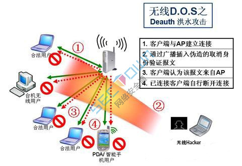

# zNetwork mapping

## 802.1X协议

>较官方的解释：802.1x协议是基于Client/Server的访问控制和认证协议。它可以限制未经授权的用户/设备通过接入端口(access port)访问LAN/WLAN。在获得交换机或LAN提供的各种业务之前，802.1x对连接到交换机端口上的用户/设备进行认证。在认证通过之前，802.1x只允许EAPoL（基于局域网的扩展认证协议）数据通过设备连接的交换机端口；认证通过以后，正常的数据可以顺利地通过以太网端口。

通俗易懂的说：不管是有线还是无线的交换机，如果支持802.1x认证并对相应端口（可以是物理上的也可以是逻辑上的）开启认证的话，我想要通过这个端口进行上网，就要想办法通过它的认证，让它知道我是经过你允许的那个他，否则交换机不让你享受他的上网服务。

### **monitor 模式是什么？**

> 数据包通过无线电信号来传输，monitor模式下的网卡可以接收所有它可以接收的无线电信号并进行解析，不仅仅限于它所在的无线局域网。

## wpa

> 在WPA的设计中要用到一个[802.1X](https://baike.baidu.com/item/802.1X)认证服务器来分发不同的密钥给各个终端用户；不过它也可以用在较不保险的“预共享密钥模式”（pre-shared key（PSK）），这是让同一无线路由器底下的每个用户都使用同一把密钥。Wi-Fi联盟把这个使用pre-shared key的版本叫做“WPA-个人版”或“WPA2-个人版”（WPA-Personal or WPA2-Personal），用802.1X认证的版本叫做“WPA-企业版”或“WPA2-企业版”（WPA-Enterprise or WPA2-Enterprise）。

### [WPS, 破解WPA/WPA2密钥的捷径](https://www.cnblogs.com/blacksunny/p/6896839.html)


1、关于WPS（WIFI保护设置)

　　WPS(WIFI保护设置)主要致力于简化无线网络的安全加密设置。传统方式下，用户新建一个无线网络时，必须在接入点手动设置网络名(SSID）和安全密钥，然后在客户端密钥以阻止“不速之客”的闯入。

　　WPS能够帮助用户自动设置网络名(SSID)、配置最高级别的WPA2安全密钥，用户只要按下WPS按钮或输入PIN码就可以完成无线加密设置。

2、WPS的基本设置

　　1、在无线客户端上运行无线网卡配置工具，选择"连接到带有WPS的无线网络“。
　　2、有些无线路由器是自动开启WPS功能的，比如TPLINK，但还有些无线设备需要使用计算机登陆到路由器页面，在有关页面中选择连接无线设备，或者按住路由器上的WPS按钮。
　　3、在无线网卡配置工具上选择PBC连接形式，或者在无线网卡上点选wps按钮。
　　4、等待数秒，连接成功。

[利用wps暴力破解pin， 使用Reaver](<https://blog.csdn.net/weixin_40586270/article/details/81280928> )

1. `iwconfig` 查看 wireless interface

2. `airmon-ng start wlan0`( `wlan0`是无线网卡)  启动moniter模式

3. 找到要破解网络的BSSID

   ```bash
   airodump-ng wlan0
   #若果上条命令错误 则 airodump-ng wlan0mon
   ```

4. 找出开启了wps,可用pin登录的ap并记录其BSSID(类似于mac)

   ```bash
   wash -i wlan0mon
   ```

5. ```bash
   reaver -i moniterface -b bssid -vv
   ```

6. 取到 PIN码 后，以后即便路由器更换了密码，我们也可以很迅速地通过 PIN码 重新获得新密码。举例：

   ​    `reaver  -i  wlan0mon -b  xx:xx:xx:xx:xx:xx  -p 12345670`

**字典式攻击**

> 在破解密码或密钥时，逐一尝试用户自定义词典中的可能密码（单词或短语）的攻击方式。与暴力破解的区别是，暴力破解会逐一尝试所有可能的组合密码，而字典式攻击会使用一个预先定义好的单词列表（可能的密码）。

字典攻击是攻击者使用一个攻击者认为可能会用在口令中的单词字典，攻击者试图重现这种口令选择的方法，从输入字典中抽出单词并且使用各种变形规则对输入的单词进行处理，用经过变形后的单词进一步匹配目标口令。对于一个成功的字典攻击它需要最原始的单词成为攻击者的输入字典，并且攻击者对字典使用正确的字处理规则。

但是也正是这个原因，字典攻击在下面的情况下会失效：

- ①目标口令的创建规则并不是攻击者猜测的容易受到攻击的规则。比如一些网站、系统推荐的随机口令。
- ②攻击者输入的字典不够全面不包含目标口令中的基本单词。
- ③攻击者使用变形规则并没有包含目标口令所使用的规则。

所以，字典攻击的成功率主要取决于所选取的字典和采取的变形规则，两者互相限制。

### Deauth attack

取消验证洪水攻击：国际上称之为De-authenticationFlood Attack，全称为取消身份验证洪水攻击或验证阻断洪水攻击，通常被简称为Deauth攻击，是无线网络拒绝服务攻击的一种形式。它旨在通过欺骗从AP到客户端单播地址的取消身份验证帧来将客户端转为未关联／未认证的状态。下图是其攻击原理图：



通过这张图可以很直观地看出，攻击者向整个网络发送了伪造的取消身份验证报文，从而阻断了合法用户和AP之间的连接。当客户端试图与AP重新建立连接时攻击者还在继续向信道中发送取消身份验证帧，这将导致客户端和AP始终无法重连。

## Host discover

[Nmap](https://nmap.org/) (“Network Mapper(网络映射器)”) 是一款开放源代码的 网络探测和安全审核的工具。它的设计目标是快速地扫描大型网络

## Host Probing

<https://nmap.org/man/zh/man-port-scanning-basics.html>


# 考试笔记

## 入侵wifi

1. 无线网卡可以工作在多种模式之下。常见的有Master，Managed，ad-hoc，monitor等模式。对于Master模式，它主要使用于无线接入点AP提供无线接入服务以及路由功能。Managed模式用于和无线AP进行接入连接，在这个模式下我们才可以进行无线接入internet上网。Monitor模式主要用于监控无线网络内部的流量，用于检查网络和排错。对于需要两台主机进行直连的情况下可以使用ad-hoc模式，这样主机之间是采用对等网络的方式进行连接。

2. 通常，手机WLAN中，bssid其实就是无线路由的MAC地址.一般， ESSID 也可认为是SSID, WIFI 网络名。

```bash
airmon-ng start wlan0  # 打开wlan0的monitor mode
airodump-ng wlan0mon  # 选定你想要攻击的对象
    #BSSID是AP端的MAC地址
    #PWR 是信号强度，数字越小越好
    #Data是对应的路由器的在线数据吞吐量，数字越大，数据上传量越大。
    #CH是对应路由器的所在频道
    #ESSID是对应路由器的名称
airodump-ng --channel 6 --bssid xx:xx:xx  --weite dump wlan0  # 监听指定目标频道，将traffic写入文件


aireplay-ng -9 wlan0  # injection测试
```


**– 使用aireplay-ng进行解除认证攻击模式。**

**握手包**指的是采用WPA加密方式的无线AP与无线客户端进行连接前的认证信息包。

一个合法的客户端要连上AP要经历四次握手**(ex.2)** 
1. 你请求连AP
2. AP发一个数据包给你 
3. 你将收到的数据包用wpa密钥加密，然后发给AP 
4. AP用自己保存的wpa密钥加密相同数据包，然后和你发给他的比较，如果相同，就发准许接入的许可。 

抓握手包，是指抓AP发给合法客户的数据包，和合法客户端加密后发给AP的数据包。所以我们就抓这两个包，当我们有了明文和密文，就可以破解出密钥。

所以我们这里的关键是要发动攻击，迫使合法的客户端断线，进行重新认证，我们趁机抓包。

```bash
# 保持上个terminal运行，打开新的terminal
aireplay-ng -0 0 -a C0:00:00:00:00:48 -c 18:00:00:00:00:88 wlan0mon
#aireplay-ng -<攻击模式，我们这里使用 解除认证攻击(黄色区域) 0 deauth, 1 fake auth, 3 replay> [攻击次数，0为无限攻击] -a <AP端的MAC地址> -c <客户端端的MAC地址> <你的的monitor名称>
```


**– 使用字典进行暴力破解。**

```bash
aircrack-ng -w Desktop/wordlist.txt Desktop/handshake-01.cap 
#aircrack-ng -w <字典路径> <握手包路径>
# 如果是wep 直接 aircrack-ng file.cap
```


**- WPS破解**

```bash
wash -i wlan0  # 查看使用了wps的路由
reaver -i wlan0 -d xx:xx:xx:xx -vv
```

## 端口扫描

| 协议                                                         | 含义                                                         | 解释                                                         | 攻击                                                         | 防范                                                         |
| ------------------------------------------------------------ | ------------------------------------------------------------ | ------------------------------------------------------------ | ------------------------------------------------------------ | ------------------------------------------------------------ |
| ARP( Address Resolution Protocol)                            | 根据IP地址获取物理地址                                       | [主机发送信息时将包含目标IP地址的ARP请求广播到网络上的所有主机，并接收返回消息，以此确定目标的物理地址；收到返回消息后将该IP地址和物理地址存入本机ARP缓存中并保留一定时间，下次请求时直接查询ARP缓存以节约资源。 | 主机可以自主发送ARP应答消息，其他主机收到应答报文时不会检测该报文的真实性就会将其记入本机ARP缓存；由此攻击者就可以向某一主机发送伪ARP应答报文，使其发送的信息无法到达预期的主机或到达错误的主机，这就构成了一个ARP欺骗。 | 1. 设置静态的MAC-->IP对应表，不要让主机刷新设定好的转换表。  除非很有必要，否则停止使用ARP，将ARP做为永久条目保存在对应表中。  2. 使用ARP服务器。通过该服务器查找自己的ARP转换表来响应其他机器的ARP广播。确 |
| SYN：同步序列编号（**Synchronize Sequence Numbers**）        | TCP/IP建立连接时使用的握手信号。                             | 在客户机和[服务器](https://baike.baidu.com/item/%E6%9C%8D%E5%8A%A1%E5%99%A8/100571)之间建立正常的TCP网络连接时，客户机首先发出一个SYN消息，服务器使用SYN+ACK应答表示接收到了这个消息，最后客户机再以[ACK](https://baike.baidu.com/item/ACK)消息响应。这样在客户机和服务器之间才能建立起可靠的TCP连接。 | SYN攻击属于DDoS攻击的一种。只要这些系统打开TCP服务就可以实施。 客户端在短时间内伪造大量不存在的IP地址，向服务器不断地发送syn包，服务器回复确认包，并等待客户的确认，由于源地址是不存在的，服务器需要不断的重发直至超时，这些伪造的SYN包将长时间占用未连接队列，正常的SYN请求被丢弃，目标系统运行缓慢，严重者引起网络堵塞甚至系统瘫痪。 | 1. 防御syn洪水攻击,一个丰富的带宽资源是非常有必要的       2. 防火墙 |
| ACK (Acknowledgement）即是确认字符                           | 在数据通信中，接收站发给发送站的一种传输类控制字符。         |                                                              |                                                              |                                                              |
| ICMP是（Internet Control Message Protocol）Internet控制[报文](https://baike.baidu.com/item/%E6%8A%A5%E6%96%87/3164352)协议。 | 用于在IP[主机](https://baike.baidu.com/item/%E4%B8%BB%E6%9C%BA/455151)、[路由](https://baike.baidu.com/item/%E8%B7%AF%E7%94%B1)器之间传递控制消息。 | 控制消息是指[网络通](https://baike.baidu.com/item/%E7%BD%91%E7%BB%9C%E9%80%9A)不通、[主机](https://baike.baidu.com/item/%E4%B8%BB%E6%9C%BA/455151)是否可达、[路由](https://baike.baidu.com/item/%E8%B7%AF%E7%94%B1/363497)是否可用等网络本身的消息。属于UDP协议 | “Ping of Death” 攻击的原理是：如果ICMP数据包的尺寸超过64KB上限时，[主机](https://baike.baidu.com/item/%E4%B8%BB%E6%9C%BA)就会出现[内存分配](https://baike.baidu.com/item/%E5%86%85%E5%AD%98%E5%88%86%E9%85%8D)错误，导致TCP/IP[堆栈](https://baike.baidu.com/item/%E5%A0%86%E6%A0%88)崩溃，致使主机死机。（[操作系统](https://baike.baidu.com/item/%E6%93%8D%E4%BD%9C%E7%B3%BB%E7%BB%9F)已经取消了发送ICMP数据包的大小的限制，解决了这个漏洞） | 第一种方法是在[路由器](https://baike.baidu.com/item/%E8%B7%AF%E7%94%B1%E5%99%A8)上对ICMP[数据包](https://baike.baidu.com/item/%E6%95%B0%E6%8D%AE%E5%8C%85)进行[带宽](https://baike.baidu.com/item/%E5%B8%A6%E5%AE%BD)限制，将ICMP占用的带宽控制在一定的范围内。 第二种方法就是在[主机](https://baike.baidu.com/item/%E4%B8%BB%E6%9C%BA)上设置ICMP数据包的处理规则 |
| 域名反向解析(RDNS)是                                         | 过查询 IP 地址的 PTR 记录来得到该 IP 地址指向的域名          |                                                              |                                                              |                                                              |
|                                                              |                                                              |                                                              |                                                              |                                                              |


**- Nmap**是一个网络连接端口扫描软件，用来扫描网上电脑开放的网络连接端口。确定哪些服务运行在哪些连接端口**，**并且推断计算机运行哪个操作系统**，**用以评估网络系统安全**。**

```bash
#1、扫描单一的一个主机：
nmap cnblogs.com
nmap 10.1.1.26
#2、扫描整个子网,命令如下:
nmap 10.1.1.26/24
#3、扫描多个目标,命令如下：
nmap 10.1.1.26 10.1.1.27
#4、扫描一个范围内的目标,如下：
nmap 10.1.1.1-100  # (扫描IP地址为10.1.1.1-10.1.1.100内的所有主机)
#5、如果你有一个ip地址列表，将这个保存为一个txt文件，和namp在同一目录下,扫描这个txt内的所有主机，命令如下：
nmap -iL target.txt
#6、如果你想看到你扫描的所有主机的列表，用以下命令:
nmap -sL 10.1.1.1/24
#7、扫描除过某一个ip外的所有子网主机,命令：
nmap 10.1.1.1/24 -exclude 10.1.1.1
#8、扫描除过某一个文件中的ip外的子网主机命令
nmap 10.1.1.1/24 -exclude file xxx.txt  
#9、扫描特定主机上的80,21,23端口,命令如下
nmap -p80,21,23 10.1.1.1
```

[**- 主机发现**](<http://www.nmap.com.cn/doc/manual.shtm#3>)

任何网络探测任务的最初几个步骤之一就是把一组IP范围(有时该范围是巨大的)缩小为 一列活动的或者您感兴趣的主机。扫描每个IP的每个端口很慢，通常也没必要。


-P*选项(用于选择 ping的类型)可以被结合使用。 您可以通过使用不同的TCP端口/标志位和ICMP码发送许多探测报文 来增加穿透防守严密的防火墙的机会。另外要注意的是即使您指定了其它 -P*选项，ARP发现(-PR)对于局域网上的 目标而言是默认行为，因为它总是更快更有效。

| 参数                          | 含义                                                         |
| ----------------------------- | ------------------------------------------------------------ |
| -sL (列表扫描)                | 列表扫描是主机发现的退化形式，它仅仅列出指定网络上的每台主机， 不发送任何报文到目标主机。 |
| -PE;                          | Nmap发送一个ICMP type 8 (回声请求)报文到目标IP地址， 期待从运行的主机得到一个type 0 (回声响应)报文。 |
| -PS [portlist] (TCP SYN Ping) | 该选项发送一个设置了SYN标志位的空TCP报文. 使用-PE选项打开该回声请求功能。 |
| -PA [portlist] (TCP ACK Ping) | TCP ACK ping和刚才讨论的SYN ping相当类似。 也许您已经猜到了，区别就是设置TCP的ACK标志位而不是SYN标志位。 ACK报文表示确认一个建立连接的尝试，但该连接尚未完全建立。 所以远程主机应该总是回应一个RST报文 |
| -PO                           | IP Proto ping                                                |

###概念

**- TCP/IP协议栈指纹**

协议栈指纹就是各个厂家，如微软和RedHat等在编写自己的TCP/IP协议栈时，却做出了不同的解释。这些解释因具有独一无二的特性，故被称为“指纹”

协议栈指纹识别是一项强大的技术，能够以很高的概率迅速确定操作系统的版本。因为由于各个厂家在编写自己的TCP/IP协议栈存在差别，而我们通过这些细微的差别，可以准确定位操作系统的版本。

例如Apache我们知道是linux， IIS我们知道是 windows.

1、FIN 探测器 
这里我们发送一个 FIN 包（或任何其他不带 ACK 或 SYN 标记的数据包）给一个打开的端口并等待回应。按照 RFC，正确的行为是不响应 ，但例如 MS Windows、BSDI、CISCO、HP/UX、MVS 和 IRIX 等都会发回一个 RESET从而暴露OS版本特征。
2、BOGUS 标记探测器 
发送一个含有未定义的TCP标记(64或者128)的TCP头的SYN包，那么一些操作系统的回应将包含这个未定义的标记，而其它一些系统收到SYN+BOGUS包将关闭连接，利用这些特性可以识别一些操作系统。
3、ISN采样探测 
这个方法是找出当响应一个连接请求时由 TCP 实现所选择的初始化序列数的式样，这样可以区分一些操作系统。 例如传统的 64K 、随机增量或真“随机”。Windows(和一些其他系统)则使用一个“时间相关”模型，每过一段时间 ISN 就被加上一个小的固定数， 不用说， 这几乎和老的 64K 实现一样容易攻破。甚至还可以通过计算其随机 
数的变化量、 最大公约数以及序列数的其他函数之间的差异之类的方法再进一步地进行分组。
4、ICMP 消息引用 
RFC 规定 ICMP 错误消息可以引用一部分引起错误的源数据包。对于一个端口不可达消息，几乎所有实现都只送回 IP 头和其后的 8 个字节。所以可以在对方没有开放端口的情况下就能探测到对方的OS


**- Echo(回音)**

>Echo服务是一种非常有用的用于调试和检测的工具。这个协议的作用也十分简单，接收到 什么原封发回就是了。 基于TCP协议的Echo服务有一种Echo服务被定义为在TCP协议上的面向 连接的应用。服务器就在TCP端口检测有无消息，如果有发送来的消息直接返回就是了

**- 端口号**

传输层中类似地址的概念，就是端口号。端口号用来识别同一台计算机中进行通信的不同应用程序。它也被成为程序地址。传输层协议利用端口号识别本机中正在进行通信的应用程序，并进行准确传输。

**- 端口状态**

默认情况下，大部分的端口都处于关闭状态 。

| 标识    | 解释                   |
| ------- | ---------------------- |
| open    | something is listening |
| closed  | nothing listening      |
| blocked | fireware               |

**- socket**？？？？？？

网络上的两个程序通过一个双向的通信连接实现数据的交换，这个连接的一端称为一个socket。

提供了一套简单的方式实现网络进程间通信。


1.确认TCP端口已经打开，并且向这个端口发送一个SYN（建立了会话）包。如果端口是开放的，目标机器会返回一个SYN/ACK包响应。如果端口没开放，那我们只有另辟蹊径咯。这是前面讨论的SYN扫描的基础哟~

2.机器接受一个未经请求的SYN/ACK包会返回RST，一个未经请求的RST会被忽略。

3.任何数据包在互联网上都有一个片段标识号（IP ID），当数据包发送的时候，许多操作系统只是简单的增加了数字，未做其他处理。所以攻击者只需要探究IPID就可以知道最终发送了多少个包。


###nmap识别的端口状态

> TCP是在IP网络层之上的传输层协议，用于提供port到port面向连接的可靠的字节流传输。
>
> **RST**表示复位，用来异常的关闭连接，在TCP的设计中它是不可或缺的。发送RST包关闭连接时，不必等缓冲区的包都发出去（不像上面的FIN包），直接就丢弃缓存区的包发送RST包。而接收端收到RST包后，也不必发送ACK包来确认。
>
> A和服务器B之间建立了TCP连接，此时C伪造了一个TCP包发给B，使B异常的断开了与A之间的TCP连接，就是RST攻击了。

**open(开放的)** 返回SYN/ACK?

应用程序正在该端口接收TCP 连接或者UDP报文。每个开放的端口 都是攻击的入口。

**closed(关闭的)** 返回RST?

关闭的端口对于Nmap也是可访问的(它接受Nmap的探测报文并作出响应)， 但没有应用程序在其上监听。 它们可以显示该IP地址上(主机发现，或者ping扫描)的主机正在运行up 也对部分操作系统探测有所帮助。 因为关闭的关口是可访问的，也许过会儿值得再扫描一下，可能一些又开放了。

**filtered(被过滤的)** 无返回?

由于包过滤阻止探测报文到达端口， Nmap无法确定该端口是否开放。过滤可能来自专业的防火墙设备，路由器规则 或者主机上的软件防火墙。

**防火墙可能发送虚假的包，是namp得到错误信息。**

###端口扫描技术

| 参数                                 | 含义                                                         | 实现                                                         |
| ------------------------------------ | ------------------------------------------------------------ | ------------------------------------------------------------ |
| -sS (TCP SYN扫描) 默认，迅速，可信赖 | SYN扫描相对来说不张扬，不易被注意到，因为它从来不完成TCP连接。 它需要高级权限。不 依赖于特定平台。 | 发送一个SYN报文， 就像您真的要打开一个连接，然后等待响应。 SYN/ACK表示端口在监听 (开放)，而 RST (复位)表示没有监听者。 |
| -sA (TCP ACK扫描) 穿过防火墙         | 它不能确定open(开放的)或者open\|filtered(开放或者过滤的))端口。 它用于发现防火墙规则，确定它们是有状态的还是无状态的，哪些端口是被过滤的。**ppt说是reachable** | ACK扫描探测报文只设置ACK标志位。 Nmap把它们标记为 unfiltered(未被过滤的)，意思是 ACK报文不能到达，但至于它们是open(开放的)或者 closed(关闭的) 无法确定。不响应的端口 或者发送特定的ICMP错误消息(类型3，代号1，2，3，9，10， 或者13)的端口，标记为 filtered(被过滤的)。**同前，unreachable**。 |

-sN; -sF; -sX (TCP Null，FIN，and Xmas扫描)

这三种扫描类型 在[TCP RFC](http://www.rfc-editor.org/rfc/rfc793.txt) 中发掘了一个微妙的方法来区分open(开放的)和 closed(关闭的)端口。

如果扫描系统遵循该RFC，当端口关闭时，**任何不包含SYN，RST，或者ACK位的报文会导致 一个RST返回，而当端口开放时，应该没有任何响应。**只要不包含SYN，RST，或者ACK， 任何其它三种(FIN，PSH，and URG)的组合都行。Nmap有三种扫描类型利用这一点：

- Null扫描 (-sN)

  不设置任何标志位(tcp标志头是0)

- FIN扫描 (-sF)

  只设置TCP FIN标志位。

- Xmas扫描 (-sX)

  设置FIN，PSH，和URG标志位，就像点亮圣诞树上所有的灯一样。

除了探测报文的标志位不同，这三种扫描在行为上完全一致。 如果收到一个RST报文，该端口被认为是 closed(关闭的)，而没有响应则意味着 端口是open|filtered(开放或者被过滤的)。

这些扫描的关键优势是它们能躲过一些无状态防火墙和报文过滤路由器。 另一个优势是这些扫描类型甚至比SYN扫描还要隐秘一些。一个很大的不足是并非所有系统都严格遵循RFC 793。 许多系统不管端口开放还是关闭，都响应RST。 这导致所有端口都标记为closed(关闭的)。 


-sI <zombie host[:probeport]> (Idlescan)

**让一个僵尸主机承担扫描任务。**这种高级的扫描方法允许对目标进行真正的TCP端口盲扫描 (意味着没有报文从您的真实IP地址发送到目标)。相反，side-channel攻击 **利用zombie主机上已知的IP分段ID序列生成算法来窥探目标上开放端口的信息。 **

是要找一台TCP序列预测成功率高的僵尸主机，这个僵尸主机必须尽可能的空闲，比如说网络打印机就是一个很好地选择，因为网络打印机不仅存在着恒定的网络资源，而且很难预测它们的TCP序列。 

除了极端隐蔽(由于它不从真实IP地址发送任何报文)， 该扫描类型可以建立机器间的基于IP的信任关系。 端口列表*从zombie 主机的角度。*显示开放的端口。 因此您可以尝试用您认为(通过路由器/包过滤规则)可能被信任的 zombies扫描目标。

需要一个 **idle** 例如printer。 不是在所有平台都使用

事实上，攻击者可以不用向目标发送数据包就完成扫描工作！


```bash
nmap 参数 -p 端口号 主机
nmap -sS www.supinfo.com

-Pn # 不发送ping包，配合-sI使用避免被发现。
```

常用默认端口

| 端口号 | 服务   |
| ------ | ------ |
| 22     | SSH    |
| 23     | Telnet |
| 25     | SMTP   |
| 53     | DNS    |
| 80     | HTTp   |


80端口不一定是httpd， 为了安全手动更换默认端口。

如何确定端口对应的是什么服务呢？ 尝试链接服务

一旦你发现开放的端口，你可以容易的使用netcat 连接服务抓取他们的banner。

```bash
$ nc -v 172.31.100.7 21  # netcat被称为网络工具中的瑞士军刀 
```

netcat 命令会连接开放端口21并且打印运行在这个端口上服务的banner信息。

如何使用开放端口的服务呢？ 链接他

```bash
 nmap -sV 10.0.1.161 # 版本检测是用来扫描目标主机和端口上运行的软件的版本
```

```bash
nmap -O source.supingo.com  # 猜测主机操作系统
# tcp/ip fingerprint
# specific service
# get information from the running service
```


## Vulnerability Scanning

> 漏洞扫描是指基于漏洞数据库，通过扫描等手段对指定的远程或者本地计算机系统的安全脆弱性进行检测，发现可利用漏洞的一种安全检测（渗透攻击）行为。
>
> 1.针对网络的扫描器
>
> 2.针对主机的扫描器
>
> 3.针对数据库的扫描器
>
> 

| 术语                                                    | 解释                                                         |
| ------------------------------------------------------- | ------------------------------------------------------------ |
| CVE  “Common Vulnerabilities & Exposures”公共漏洞和暴露 | CVE就好像是一个字典表，为广泛认同的[信息安全](https://baike.baidu.com/item/%E4%BF%A1%E6%81%AF%E5%AE%89%E5%85%A8/339810)漏洞或者已经暴露出来的弱点给出一个公共的[名称](https://baike.baidu.com/item/%E5%90%8D%E7%A7%B0/6546057)。使用一个共同的名字，可以帮助用户在各自独立的各种漏洞数据库中和漏洞评估[工具](https://baike.baidu.com/item/%E5%B7%A5%E5%85%B7/81891)中共享数据，虽然这些工具很难整合在一起。 如果在一个漏洞报告中[指明](https://baike.baidu.com/item/%E6%8C%87%E6%98%8E/633104)的一个漏洞，如果有CVE名称，你就可以快速地在任何其它CVE兼容的数据库中找到相应修补的信息，解决安全[问题](https://baike.baidu.com/item/%E9%97%AE%E9%A2%98/1067365)。 |
| OVAL(open Vulnerability and assement language)          | OVAL includes a language used to encode system details, and an assortment of content repositories held throughout the community. standardizes .  is an international, information security, community effort to promote open and publicly available security content, and to standardize the transfer of this information across the entire spectrum of security tools and services |
| CPE(common product enumeration)                         | A standard machine-readable format for encoding names of IT products and platforms.  A set of procedures for comparing names.  A language for constructing "applicability statements" that combine CPE names with simple logical operators.  A standard notion of a CPE Dictionary. |

### 使用nmap vulnerability scan

缺点是扫描报告不易读，但是可以用xsltproc转换xml为html。

漏斗扫描需要增加script参数，可选的script有;exploit,external,vuln,auth,default.

```bash
namp -sV --script=exploit,external,vuln,auth,default > -oX report.xml 192.168.82.187

xsltproc report.xml -o report.html
```

nmap 脚本一些支持笼统扫描 usag. nmap -F --script auth 10.0.0.1

auth: 负责处理鉴权证书（绕开鉴权）的脚本

broadcast: 在局域网内探查更多服务开启状况，如 dhcp/dns/sqlserver 等服务

brute: 提供暴力破解方式，针对常见的应用如 http/snmp 等

default: 提供基本脚本扫描能力

discovery: 对网络进行更多的信息，如 SMB 枚举、SNMP 查询等

dos: 用于进行拒绝服务攻击

exploit: 利用已知的漏洞入侵系统

external: 利用第三方的数据库或资源，例如进行 whois 解析

fuzzer: 模糊测试的脚本，发送异常的包到目标机，探测出潜在漏洞 

intrusive: 入侵性的脚本，此类脚本可能引发对方的 IDS/IPS 的记录或屏蔽

malware: 探测目标机是否感染了病毒、开启了后门等信息

safe: 此类与 intrusive 相反，属于安全性脚本

version: 负责增强服务与版本扫描（Version Detection）功能的脚本

vuln: 负责检查目标机是否有常见的漏洞（Vulnerability），如是否有 MS08_067

### 使用openvas vulnerability scan

GPL，GNU General Public License。 fork of Nessus。

Manager用于调配所有的组件，Scanner用于扫描目标主机，GreenboneSecurityAssistant用于提供web接口。


| OpenVAS-scanner(扫描器)       | 负责调用各种漏洞检测插件，完成实际的扫描操作。 | OpenVAS-cli（命令行接口）              | 负责提供从命令行访问OpenVAS服务层程序。                      |
| ----------------------------- | ---------------------------------------------- | -------------------------------------- | ------------------------------------------------------------ |
| OpenVAS-manager(管理器)       | 负责分配扫描任务，并根据扫描结果生产评估报告。 | Greenbone-security-assistant(安全助手) | 负责提供访问OpenVAS服务层的Web接口，便于通过浏览器来建立扫描任务，是使用最简便的客户层组件。 |
| OpenVAS-administrator(管理者) | 负责管理配置信息，用户授权等相关工作。         | Greenbone-Desktop-Suite(桌面套件)      | 负责提供访问OpenVAS服务层的图形程序界面，主要在windows系统中使用。 |


```bash
/etc/init.d/openvasad start
/etc/init.d/openvasmd start
/etc/init.d/openvassd start

/etc/init.d/gsad start  # 打开greenbine-security  提供web接口

./openvas-check-setup  # 检查openvas是否完整安装
openvas-cerdata-sync && openvas-nvt-sync  # 认证数据和nvt数据库
openvasmd --rebuild && openvasmd --migrate  
```


### 使用nessus vulnerability scan

曾经免费现在商业化，应用最广泛最精确的工具

所有主流平台都可以运行，主要用于*nix系列，结构与openvas一样，只有唯一的Daemon nessud

## 实用指南

**- shellcode**

shellcode是一段用于利用软件漏洞而执行的代码，shellcode为16进制的机器码，因为经常让攻击者获得shell而得名。shellcode常常使用机器语言编写。 可在暂存器eip溢出后，塞入一段可让CPU执行的shellcode机器码，让电脑可以执行攻击者的任意指令。

**- payload**

病毒通常会做一些有害的或者恶性的动作。在病毒代码中实现这个功能的部分叫做“有效负载”（payload）。payload可以实现任何运行在受害者环境中的程序所能做的事情，并且能够执行动作包括破坏文件删除文件，向病毒的作者或者任意的接收者发送敏感信息，以及提供通向被感染计算机的后门。

简单来说，Payload是黑客用来与被黑了的系统交互的简单脚本。使用payload，可以将数据传输到已经沦陷的系统。

**- 缓冲区溢出攻击**

[缓冲区](https://baike.baidu.com/item/%E7%BC%93%E5%86%B2%E5%8C%BA)溢出是指当计算机向缓冲区内填充数据位数时超过了缓冲区本身的容量，溢出的数据覆盖在合法数据上。最常见的手段是通过制造缓冲区溢出使程序运行一个用户shell，再通过shell执行其它命令。如果该程序属于root且有suid权限的话，攻击者就获得了一个有[root权限](https://baike.baidu.com/item/root%E6%9D%83%E9%99%90)的shell，可以对系统进行任意操作了。

最普遍的漏洞。通过溢出，将shellcode覆盖在缓冲区上，从而获得权限。

<https://www.360zhijia.com/anquan/438720.html>


**- Metasploit**

Metasploit是一个免费的、可下载的框架，通过它可以很容易地获取、开发并对计算机软件漏洞实施攻击。它本身附带数百个已知软件漏洞的专业级漏洞攻击工具。


# 术语

| 术语     | 解释                                                         |
| -------- | ------------------------------------------------------------ |
| 抓鸡     | 利用使用量大的程序的漏洞，使用自动化方式获取肉鸡的行为。     |
| Webshell | 通过Web入侵的一种脚本工具，可以据此对网站服务进行一定程度的控制。 |
| 肉鸡     | 被黑客入侵并被长期驻扎的计算机或服务器。可以随意控制，可以是任意系统的设备，对象可以是企业，个人，政府等等所有单位。 |
| 漏洞     | 硬件、软件、协议等等的可利用安全缺陷，可能被攻击者利用，对数据进行篡改，控制等。 |
| 木马     | 通过向服务端提交一句简短的代码，配合本地客户端实现webshell功能的木马。 |
| 提权     | 操作系统低权限的账户将自己提升为管理员权限使用的方法。       |
| 后门     | 黑客为了对主机进行长期的控制，在机器上种植的一段程序或留下的一个"入口"。 |
| 跳板     | 使用肉鸡IP来实施攻击其他目标，以便更好的隐藏自己的身份信息。 |
| 旁站入侵 | 即同服务器下的网站入侵，入侵之后可以通过提权跨目录等手段拿到目标网站的权限。常见的旁站查询工具有：WebRobot、御剑、明小子和web在线查询等 |
| C段入侵  | 即同C段下服务器入侵。如目标ip为192.168.180.253 入侵192.168.180.*的任意一台机器，然后利用一些黑客工具嗅探获取在网络上传输的各种信息。常用的工具有：在windows下有Cain，在UNIX环境下有Sniffit, Snoop, Tcpdump, Dsniff 等。 |
| 黑盒测试 | 在未授权的情况下，模拟黑客的攻击方法和思维方式，来评估计算机网络系统可能存在的安全风险。黑盒测试不同于黑客入侵，并不等于黑站。黑盒测试考验的是综合的能力（OS、Datebase、Script、code、思路、社工）。思路与经验积累往往决定成败。 |
| 白盒测试 | 相对黑盒测试，白盒测试基本是从内部发起。白盒测试与黑盒测试恰恰相反，测试者可以通过正常渠道向被测单位取得各种资料，包括网络拓扑、员工资料甚至网站或其它程序的代码片断，也能够与单位的其它员工（销售、程序员、管理者……）进行面对面的沟通。 |
| APT攻击  | Advanced Persistent Threat，高级可持续性攻击，是指组织(特别是政府)或者小团体利用先进的攻击手段对特定目标进行长期持续性网络攻击的攻击形式。 |


### 

